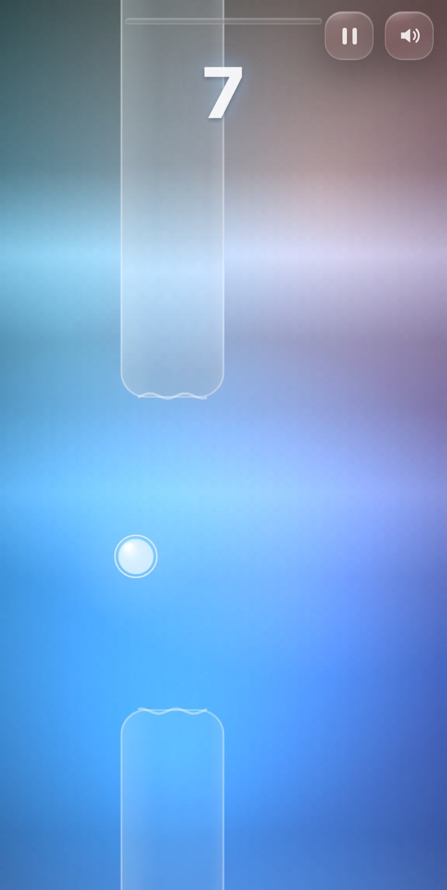
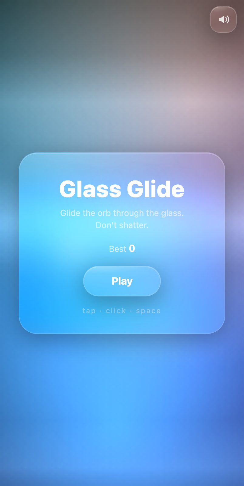
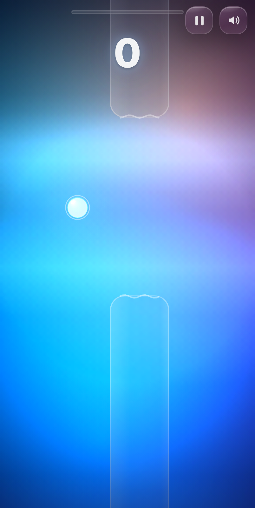
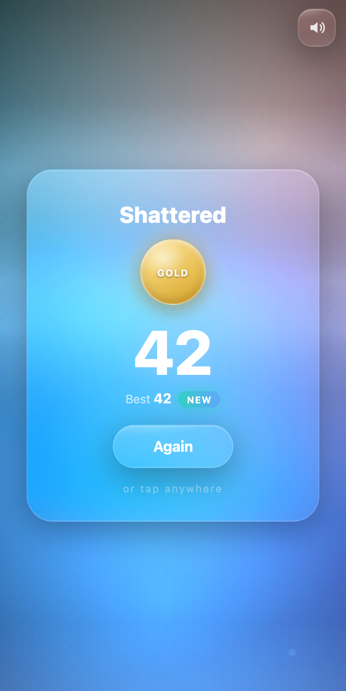

<div align="center">

# Glass Glide

**Flappy Bird mechanics reimagined in a liquid-glass aesthetic.**

A glowing orb, frosted-glass pillars that refract the world behind them, and a
whole lot of juice — built as a single-page game in **vanilla TypeScript** with
**zero runtime dependencies**. Just the Canvas2D and WebAudio APIs.



</div>

---

## Screenshots

<table>
  <tr>
    <td align="center"><br/><sub><b>Liquid-glass start card</b></sub></td>
    <td align="center"><br/><sub><b>Lens mode — 0.5× slow-mo</b></sub></td>
  </tr>
  <tr>
    <td align="center"><br/><sub><b>Refractive glass pillars + caustics</b></sub></td>
    <td align="center"><br/><sub><b>Glass medals &amp; best-score chase</b></sub></td>
  </tr>
</table>

## Features

- **Watery glass refraction** — pillars and the lens magnify and *ripple* the
  blurred background behind them, with a rippling liquid cap edge and drifting
  underwater caustics.
- **Lens mode** — collect a floating glass lens to slow time to 0.5× for four
  seconds, with a vignette and a heavy saturation push.
- **Shield bubble** — a rarer pickup that absorbs one hit and pops with a ring
  instead of ending your run.
- **Dynamic difficulty** — gap size and pillar speed ease from friendly to
  brutal over the first 30 pillars, shown as a glass "pressure" rail up top.
- **Drifting pillars** — past pillar 18, some pillars slowly slide vertically,
  telegraphed by a brighter cyan rim.
- **Near-miss sparkle** — graze a pillar without dying for a spark + chime.
- **Ghost replay** — on death, the last two seconds replay as a translucent
  ghost behind the game-over card.
- **Day cycle** — the blob palette cross-fades every 10 points: dusk → neon
  night → dawn.
- **Glass medals** — bronze, silver, and gold tiers on the game-over card.
- **Juice** — particle bursts, glass-shard death with crack flashes, screen
  shake, and a chromatic flash.
- **Fully synthesized audio** — every sound (flap, score chime, shatter, and a
  generative ambient pad) is WebAudio-only. No audio files.
- **Haptics** on supported mobile devices.

## Controls

| Input | Action |
| --- | --- |
| **Tap / Click / Space** | Flap (and start / restart) |
| **P** or **Esc** | Pause |
| **M** | Mute |

## Quick start

```bash
npm install
npm run dev      # → http://localhost:5173
```

Production build (runs a strict `tsc` type-check, then bundles):

```bash
npm run build
npm run preview  # serve the built bundle
```

## How it works

Clean module split, TypeScript `strict` throughout:

| File | Responsibility |
| --- | --- |
| `src/game.ts` | Game state, delta-time physics, difficulty ramp, collisions |
| `src/render.ts` | All Canvas2D drawing: glass, refraction, particles, effects |
| `src/audio.ts` | WebAudio synthesis — SFX and the generative ambient pad |
| `src/ui.ts` | The DOM glass layer: cards, HUD, pressure rail, medals |
| `src/main.ts` | Input, resize, visibility, and the `requestAnimationFrame` loop |

### The glass performance trick

Real CSS `backdrop-filter` is the most expensive thing you can put on a mobile
GPU — every blurred surface is its own compositing layer re-running the blur
each frame. So Glass Glide splits the difference:

- **UI panels** (cards, HUD, rail) use real `backdrop-filter: blur(22px)
  saturate(1.7)` — but never more than ~4 are on screen at once.
- **Pillars** use a *fake*: the background is rendered to a tiny offscreen
  canvas, and each pillar samples it back **magnified** through a rounded
  clip. The upscale gives free blur and the magnification reads as refraction —
  convincing glass at a fraction of the cost, so the game holds 60fps with many
  pillars on screen.

### Accessibility

`prefers-reduced-motion` disables screen shake, blob drift, and all the wave /
caustic animation. The orb, pillars, and UI render statically.

### Tuning

Most feel knobs live in the `TUNING` object at the top of `src/game.ts` —
gravity, flap impulse, gap/speed ramp, pickup cadence, drift, and graze band.
Medal thresholds are in `src/ui.ts`; ambient-pad volume/tempo are at the top of
`src/audio.ts`; wave amplitudes are in `src/render.ts`.

## License

[MIT](LICENSE) © Santosh Ravi Teja Goteti
